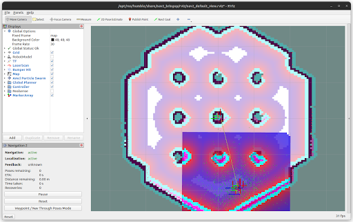
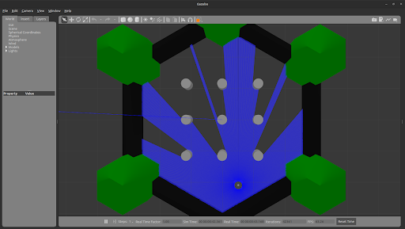
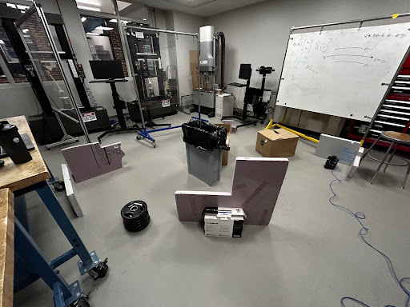

# Custom PID Controller for TurtleBot3 (Aug 2025 - Dec 2025)

## Project Goal
The aim of this project was to design and implement a **custom PID controller plugin** for the ROS2 Nav2 autonomy stack.  
This controller enables a TurtleBot3 Burger robot to navigate dynamic environments (like restaurants or gyms) safely and fluidly, handling both static and moving obstacles.

See google drive for [Competition Video](https://drive.google.com/drive/u/0/folders/1yTib5xrnqzO3QgYMHM2jq7D21an6I8e4)

---

## Development Platform
- **Robot:** TurtleBot3 Burger  
- **Compute:** Raspberry Pi 4 running Ubuntu 22.04  
- **Middleware:** ROS2 with Nav2 stack  
- **Sensors:** 360° lidar for SLAM and obstacle detection  
- **Mapping:** ROS2 Cartographer used to generate prior maps for path planning  

The controller was integrated as a **Nav2 plugin**, receiving planned paths and publishing linear/angular velocity commands to the robot.

---

## Controller Approach
A **PID controller** was chosen for its simplicity, responsiveness, and low computational cost.

- **Proportional (Kp):** Quick corrections to distance/heading errors  
- **Integral (Ki):** Eliminates steady‑state drift  
- **Derivative (Kd):** Smooths motion and reduces overshoot  

### Control Strategy
1. **Path Parsing:** At each iteration, the closest waypoint from Nav2’s path is selected.  
2. **Error Calculation:**  
   - Distance error = Euclidean distance to waypoint  
   - Heading error = angular difference between robot orientation and waypoint direction  
3. **PID Computation:** Separate gains applied for linear and angular velocity.  
4. **Velocity Command:** Summed PID outputs published as `Twist` messages (linear `v`, angular `w`).  

---

## 🔧 Final Gains
| Gain Type      | Linear | Angular |
|----------------|--------|---------|
| Proportional   | 0.8    | 1.0     |
| Integral       | 0.015  | 0.015   |
| Derivative     | 0.35   | 0.45    |

---

## Tuning Process
- Conducted in **Gazebo simulation** using the default turtlesim world.  
- Incrementally tuned P → I → D terms until achieving stable yet responsive motion.  
- Validated by commanding the robot to multiple map locations and observing behavior.

  
  

Screenshots of the tuning environment in **RViz** and **Gazebo**, displayed with the TurtleBot map.

---

## Real‑World Testing
Three environments were tested (12 ft traversal from corner to corner):  
1. **No obstacles**  
2. **Single obstacle**  
3. **Multiple obstacles (tight paths)**  

Testing Area Setup

### Results
| Trial | No Obstacles | One Obstacle | Multiple Obstacles |
|-------|--------------|--------------|--------------------|
| 1     | 26.92s       | 28.69s       | 28.90s             |
| 2     | 26.99s       | 26.97s       | 28.23s             |
| 3     | 25.89s       | 26.54s       | 27.28s             |
| 4     | 27.01s       | 28.46s       | 28.15s             |
| 5     | 26.67s       | 27.78s       | 29.20s             |
| **Avg** | **26.70s** | **27.69s**   | **28.35s**         |
| **Std Dev** | 0.47s | 1.28s | 0.75s |

---

## Key Observations
- Fastest average time: **no obstacles** (shortest path).  
- Slowest average time: **multiple obstacles** (tight navigation).  
- **Safety:** The TurtleBot never collided with obstacles across all trials.  

---

## Conclusion
This project demonstrates that a **simple PID controller plugin** can reliably handle dynamic navigation tasks in ROS2 Nav2.  
Despite being underactuated and nonholonomic, the TurtleBot achieved smooth, collision‑free navigation in both simulated and real‑world environments.
